# Silent Cart: FreshBasket Loyalty Churn Prediction & Retention Strategy

*Final report · Data Science · Prepared with the reproducible pipeline in this repository (`python run_pipeline.py`)*

---

## Executive summary

- **Most of the churn being reported has already happened.** Of the 2,368 churn-eligible members, 34.3% are
  labelled churned. But **80% of those "churners" had already stopped buying before April**: they
  had made no purchase for 3+ months. They need a *win-back* programme, not a prediction model.
- **The real prediction problem is among Active members** (bought in Jan-Mar 2024): 1,715 members, of whom
  9.6% churned. Here a recency rule gets a PR-AUC of only 0.46; our **logistic regression** reaches
  **0.79** on an untouched, out-of-time test quarter. At the chosen threshold it catches **76% of Active churners at
  70% precision** (base rate 9.6%). The top 10% of scores hold 7.5x the average churn rate.
- **Churn has a visible fingerprint.** In the ~2 months before their last purchase, churners' transactions, app sessions and email
  opens fall sharply while support tickets spike. Members with 3+ tickets in 6 months churn at 37%, against 4% for those
  with none. Members whose spend fell 40%+ quarter-on-quarter churn at 37%.
- **Tier does not protect.** Platinum members churn as often as Silver (34% vs
  35%). Age, tenure and tier are not statistically related to churn among Active members.
  Behaviour, engagement and support experience are.
- **Targeting beats blanket offers.** Today's approach, the same coupon for everyone, costs $23,680 for this cohort and loses
  $15,423 under our stated assumptions. A **next-best-action playbook** (personalised coupon, proactive service call or
  win-back, chosen per member by expected value) costs $3,860 (84% less), prevents about
  43 churners (73% of the blanket offer's saves) and returns
  **$3,559**. That is a swing of about $80,161 per 10,000 eligible members per quarter.

**Recommendation:** split the churn KPI into *Lapsed* (win-back) and *At-risk Active* (retention). Score members monthly, route each one
to its next best action, and prove the uplift with a 20% hold-out control group before scaling.

---

## 1. Business question and approach

FreshBasket sends the same retention offers to every member, which wastes money on members who were never going to leave. Management asked
four questions: **who** will churn, **which signals** come first, whether **tier, marketing engagement and support experience** matter,
and **what action** would reduce churn.

The pipeline runs in eight steps: **data quality → leakage-safe features → rolling-origin validation → four models compared →
calibration and threshold tuning → SHAP drivers and segments → ablation → retention economics**. It is a reproducible Python package
(`src/`) with one entry point (`run_pipeline.py`), MLflow experiment tracking, unit tests (including an automated leakage test), a
FastAPI scoring endpoint and a PySpark port of the feature pipeline for Databricks.

## 2. Data quality: what was wrong and how it was handled

The workbook has three tables: 2,600 members, 28k member-months, Jan-2023 to Jun-2024. Every sheet carries a title banner, so the
real header is on row 2. Reading with defaults silently yields `Unnamed` columns. All 28 checks are logged in
`outputs/data_quality_log.csv`. The issues found:

| Table | Issue | Rows | Handling |
|---|---|---|---|
| profile | Exact duplicate rows | 8 | Dropped |
| profile | CITY: inconsistent casing / whitespace | 104 | Stripped and title-cased (40 raw -> 10 clean values) |
| profile | MEMBERSHIP_TIER: inconsistent casing / whitespace | 104 | Stripped and title-cased (12 raw -> 3 clean values) |
| profile | AGE missing | 78 | Kept as missing; median-imputed at feature time + AGE_MISSING flag |
| profile | GENDER missing | 52 | Filled with explicit 'Unknown' category |
| profile | HOME_STORE_PRICE_TIER missing | 130 | Filled with explicit 'Unknown' category |
| activity | Exact duplicate rows | 58 | Dropped |
| activity | Conflicting duplicates (same customer-month, spend sign flipped) | 4 | Kept the row with positive spend |
| activity | Negative TOTAL_SPEND with transactions > 0 | 22 | Rebuilt as TRANSACTIONS x AVG_BASKET_VALUE |
| activity | Zero TOTAL_SPEND with transactions > 0 | 20 | Rebuilt as TRANSACTIONS x AVG_BASKET_VALUE |
| activity | Outlier TOTAL_SPEND (> 3x transactions x basket) | 13 | Rebuilt as TRANSACTIONS x AVG_BASKET_VALUE (max was $3,731) |
| activity | Remaining high spend after repair (> Q3 + 3 IQR) | 60 | Kept: consistent with transactions x basket, so genuine big shoppers |
| activity | Zero-transaction months (engagement but no purchase) | 2,330 | Kept: valid inactivity signal; spend/basket/promo already 0 |
| activity | Zero-transaction months reporting DISTINCT_CATEGORIES > 0 | 1,452 | Set DISTINCT_CATEGORIES to 0 (cannot buy categories without a transaction) |
| activity | Zero-transaction months reporting COUPONS_REDEEMED > 0 | 653 | Set COUPONS_REDEEMED to 0 (a redemption requires a transaction) |
| activity | Missing months inside a member's active span (769 members) | 953 | Not imputed as zero: treated as missing data; MISSING_MONTHS_6M feature added |
| activity | Profiled members with no activity rows at all | 6 | Cannot be scored; excluded from modelling |
| label | Exact duplicate rows | 5 | Dropped |
| label | LAST_PURCHASE_DATE missing (member never purchased) | 120 | Not churn-eligible by definition; excluded from modelling |
| label | CHURNED disagrees with label re-derived from activity (99.7% agree) | 9 | Official label kept; mismatches trace to missing activity rows |
| label | CHURNED=1 but no pre-April purchase visible in activity | 5 | Excluded (no history to build features from) |
| label | Leaky columns: LAST_PURCHASE_DATE, MONTHS_OBSERVED, INSUFFICIENT_HISTORY_FLAG | 3 | Computed with Apr-Jun 2024 data; never used as features. Rebuilt from pre-cutoff data instead |

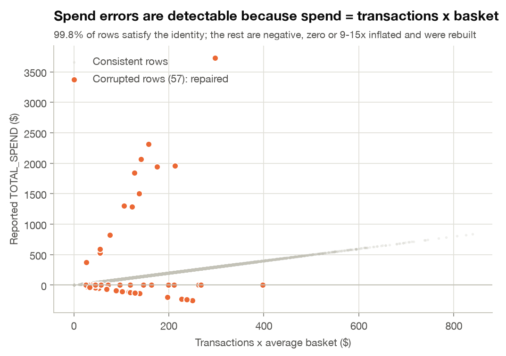

**Leakage audit.** Three label-table columns, `LAST_PURCHASE_DATE`, `MONTHS_OBSERVED` and `INSUFFICIENT_HISTORY_FLAG`, are
calculated over the full window *including* Apr-Jun 2024. Churners stop generating rows, so these columns partly encode the answer. They are
never used. Leakage-safe equivalents (`recency_months`, `history_months`, `short_history`) are rebuilt from pre-cut-off data. Section 5 shows
that including the leaky columns would inflate Active-member PR-AUC from 0.80 to 0.87.

## 3. What churn really looks like

### 3.1 A leaky bucket hidden by sign-ups
Every month roughly 55 members make their final purchase, while new sign-ups keep headline member counts rising. The loss is invisible
in the totals.

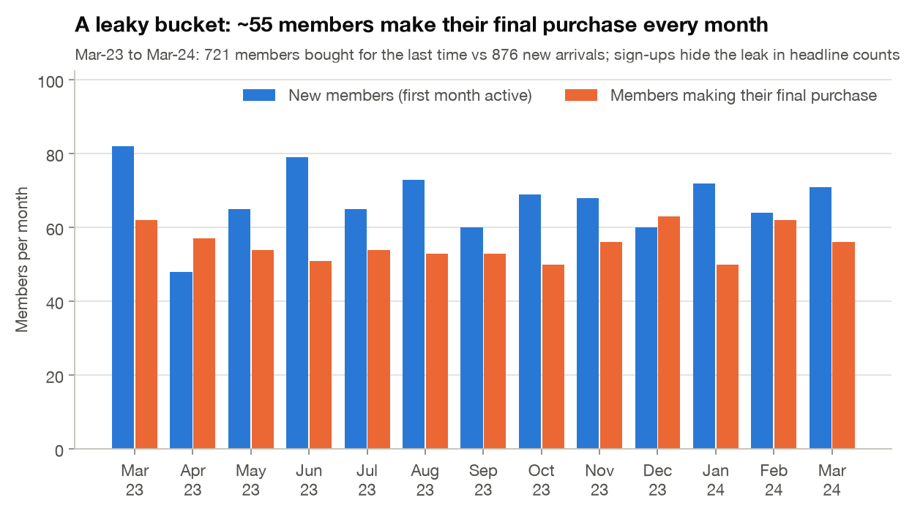

### 3.2 Two churn problems inside one label
Churn probability is a cliff in recency. Members who last bought 1 month before April churn at 3%; 2 months, 38%; 3 months,
81%; 4+ months, about 100%. The label combines members who left months ago with members who are about to leave.

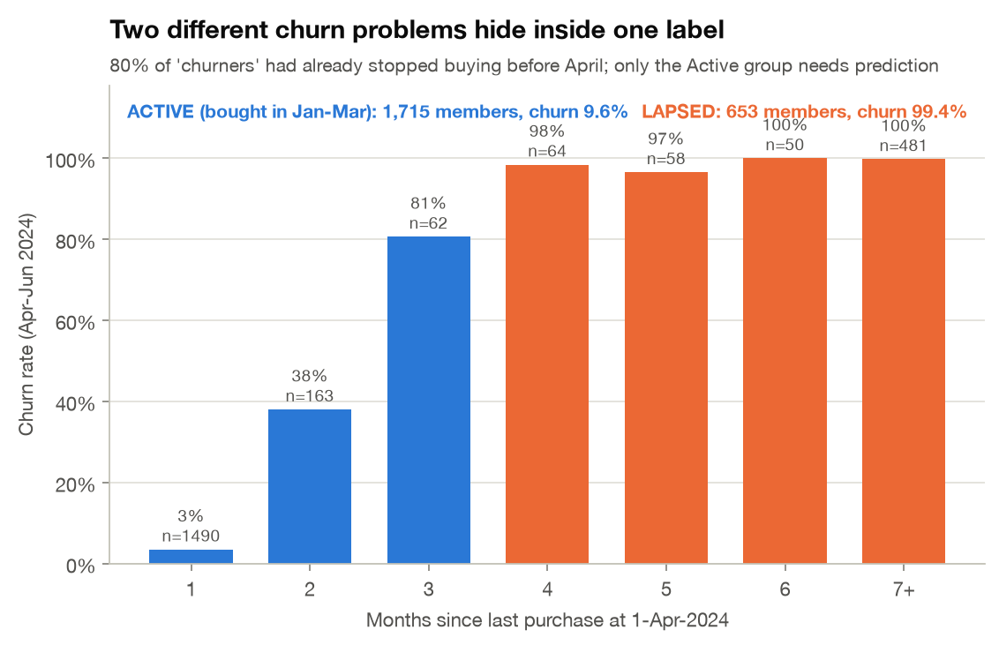

| Segment | Members | Churn rate | Share of churners | What it needs |
|---|---|---|---|---|
| Lapsed (no purchase Jan-Mar 2024) | 653 | 99.4% | 80% | Win-back campaign; a rule identifies them |
| Active (purchased Jan-Mar 2024) | 1,715 | 9.6% | 20% | Early warning model + retention action |

### 3.3 The churn fingerprint
Lining up Active members on their last pre-April purchase shows *how* churn unfolds. Purchases, app sessions and email opens fade over the
final ~2 months while support tickets spike. Those ~2 months are the intervention window.

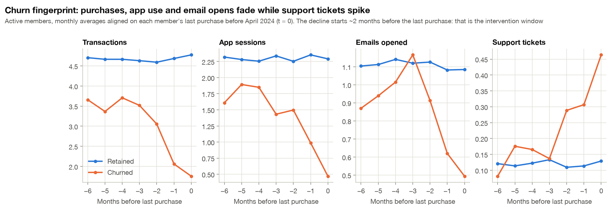

## 4. Engagement and support experience vs churn

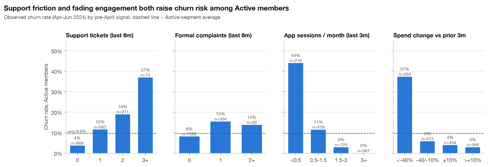

Statistical evidence for Active members: Mann-Whitney U tests, Benjamini-Hochberg corrected. Rank-biserial r > 0 means churners score higher.

| Group | Feature | Mean (churned) | Mean (retained) | Effect size (r) | q (BH) |
|---|---|---|---|---|---|
| Behavioural | txn_l3 | 1.35 | 4.60 | -0.84 | <0.001 |
| Engagement | app_l3 | 0.58 | 2.27 | -0.75 | <0.001 |
| Behavioural | categories_l3 | 1.11 | 2.57 | -0.66 | <0.001 |
| Behavioural | txn_change_pct | -0.41 | 0.11 | -0.63 | <0.001 |
| Behavioural | recency_months | 1.99 | 1.08 | +0.63 | <0.001 |
| Behavioural | spend_change_pct | -0.36 | 0.12 | -0.62 | <0.001 |
| Behavioural | active_months_l3 | 1.77 | 2.66 | -0.59 | <0.001 |
| Engagement | coupons_l3 | 0.18 | 0.59 | -0.55 | <0.001 |
| Engagement | app_change_pct | -0.40 | 0.16 | -0.51 | <0.001 |
| Engagement | email_l3 | 0.43 | 1.09 | -0.49 | <0.001 |
| Support | tickets_6m | 1.49 | 0.63 | +0.43 | <0.001 |
| Support | tickets_l3 | 1.02 | 0.33 | +0.40 | <0.001 |

- **Engagement:** churners opened 0.4 emails/month vs 1.1, and used the app
  0.6 vs 2.3 sessions/month (r = -0.75).
  Members with fewer than 0.5 app sessions/month churn at 46%.
- **Support:** churners raised 1.5 tickets in 6 months vs 0.6. A formal
  complaint in the last quarter roughly doubles churn (17% vs
  9%; chi-square p = 0.0004).
- **Not significant:** tier, age and tenure (q > 0.6). Marketing opt-in is borderline (q = 0.06).

## 5. Modelling and validation

**Validation design (no random split).** The churn definition can be replayed at any cut-off, so we built forward-chaining snapshots:

| Role | Cut-off | Label window | Members | Churn | Active churn |
|---|---|---|---|---|---|
| Train | Jul-2023, Oct-2023 | Jul-Sep, Oct-Dec 2023 | 3,767 rows | 21.5% | 10.2% |
| Validation (model choice, calibration, threshold) | Jan-2024 | Jan-Mar 2024 | 2,167 | 30.1% | 10.2% |
| **Test (reported once)** | Apr-2024 | **Apr-Jun 2024, official label** | 2,368 | 34.3% | 9.6% |

**Models compared:**
- (a) a **recency rule** (rule-based baseline: churn rate by months since last purchase);
- (b) **logistic regression** with class weights;
- (c) **random forest** with balanced class weights;
- (d) **gradient boosting** with balanced sample weights.

Hyper-parameters were chosen on validation **Active-member PR-AUC**, since that is where prediction is hard. Re-weighted scores were then
Platt-calibrated on validation, so outputs are real probabilities. The threshold maximises validation Active-member F1.

**Results on the untouched Apr-Jun 2024 test quarter:**

| Model | Population | Precision | Recall | F1 | PR-AUC (95% CI) | ROC-AUC | Accuracy | Lift @ top 10% |
|---|---|---|---|---|---|---|---|---|
| Recency rule | All eligible | 0.867 | 0.936 | 0.900 | 0.944 (0.93-0.96) | 0.961 | 0.929 | 2.9x |
| Recency rule | Active only | 0.498 | 0.683 | 0.576 | 0.464 (0.39-0.54) | 0.814 | 0.904 | 5.7x |
| Logistic regression | All eligible | 0.930 | 0.952 | 0.941 | 0.986 (0.98-0.99) | 0.991 | 0.959 | 2.9x |
| Logistic regression | Active only | 0.698 | 0.762 | 0.729 | 0.794 (0.73-0.85) | 0.961 | 0.946 | 7.5x |
| Random forest | All eligible | 0.918 | 0.956 | 0.937 | 0.987 (0.98-0.99) | 0.991 | 0.956 | 2.9x |
| Random forest | Active only | 0.663 | 0.780 | 0.717 | 0.775 (0.71-0.83) | 0.955 | 0.941 | 7.4x |
| Gradient boosting | All eligible | 0.934 | 0.953 | 0.943 | 0.989 (0.98-0.99) | 0.992 | 0.961 | 2.9x |
| Gradient boosting | Active only | 0.708 | 0.768 | 0.737 | 0.807 (0.75-0.86) | 0.962 | 0.948 | 7.6x |

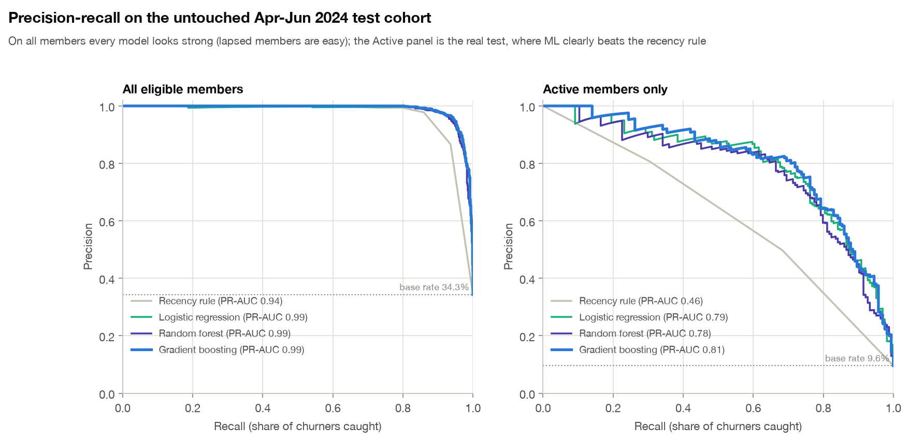

- On *all* members every model scores above 0.94 PR-AUC, because lapsed members are trivially predictable. **The Active panel is the real test:**
  machine-learning models roughly double the recency rule's PR-AUC (0.46 to about 0.8).
- **Logistic regression was selected on validation.** Gradient boosting scores slightly higher on test (0.807 vs 0.794), but the
  bootstrap intervals overlap almost entirely: the models are statistically tied. The transparent, cheaper model is deployed, and
  gradient boosting is kept as a challenger and SHAP cross-check.

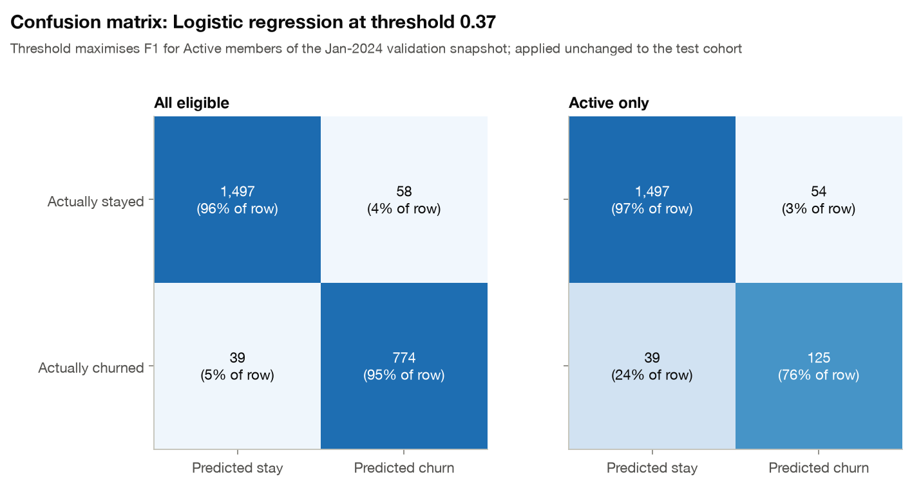
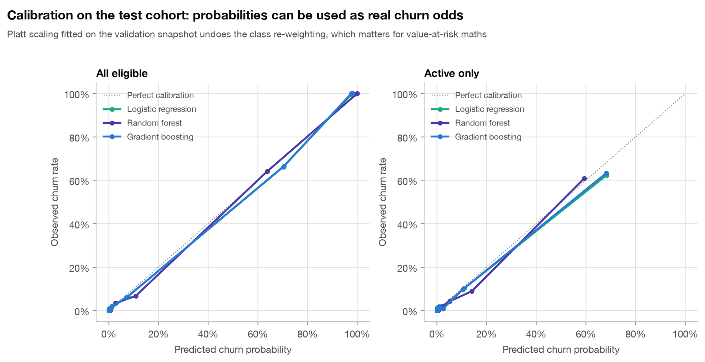

**Validation-design checks** (5-fold random CV on the test cohort, shown only for comparison):

| Set-up | PR-AUC all | PR-AUC Active |
|---|---|---|
| Out-of-time test (reported), clean features | 0.989 | 0.807 |
| Random 5-fold CV, clean features | 0.987 | 0.800 |
| Random 5-fold CV, + leaky label columns | 0.992 | 0.872 |

Random CV scores close to the out-of-time result on this dataset, so behaviour is stable over time. The leaky label columns,
however, would have inflated Active-member PR-AUC by about 0.07.

## 6. Churn drivers (SHAP) and segment risk

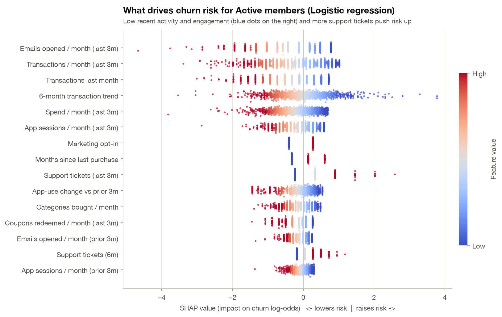
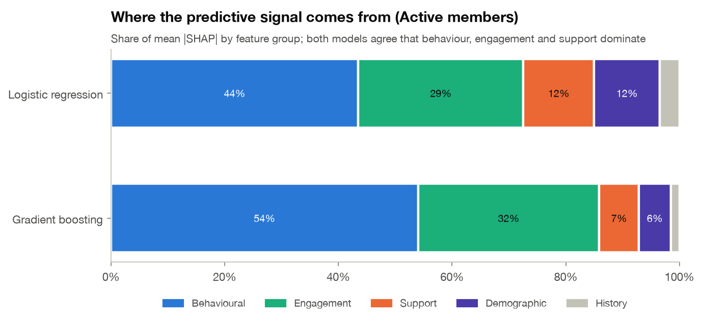

The strongest drivers for Active members are emails opened / month (last 3m), transactions / month (last 3m), transactions last month, 6-month transaction trend, spend / month (last 3m), app sessions / month (last 3m). Behaviour and engagement account for 73% of attribution in the
logistic regression and 86% in gradient boosting. Support is the next layer; demographics add little. In the logistic model, *marketing opt-in* raises risk once email opens are
accounted for: members who opted in but stopped opening emails are disengaging. This is a conditional effect, not a reason to avoid
opt-ins.

Every member gets three plain-English, risk-increasing drivers in `outputs/churn_predictions.csv`. Examples from the high-risk Active
list:

| Member | Churn probability | Top 3 drivers (SHAP) |
|---|---|---|
| 502373 | 100% | 4 support tickets in last 3m; Transactions trending down (-1.8/month); 1.0 transactions/month (last 3m) |
| 501335 | 100% | 3 support tickets in last 3m; Transactions trending down (-1.5/month); 0.5 transactions/month (last 3m) |
| 501338 | 99% | 3 support tickets in last 3m; Transactions trending down (-1.3/month); 0.3 transactions/month (last 3m) |
| 500989 | 99% | 4 support tickets in last 3m; 1.0 transactions/month (last 3m); Transactions trending down (-0.9/month) |
| 501056 | 99% | 0.7 transactions/month (last 3m); No marketing emails opened in last 3m; Transactions trending down (-0.9/month) |

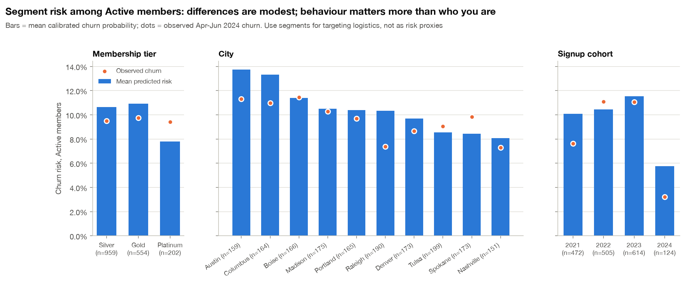

**Segments.** Among Active members, predicted risk ranges from 8%
(Nashville) to 14% (Austin). Austin and Columbus are the highest-risk cities.
Platinum members score slightly lower predicted risk, yet *observed* churn is flat across tiers. Members who joined in 2024 churn least (honeymoon period).
Segment differences are much smaller than behavioural ones, so segments should guide *logistics* (which store team, which channel),
not who is targeted.

## 7. Ablation: do behaviour, engagement and support add value over demographics?

Each step adds a feature group cumulatively (gradient boosting, test quarter):

| Feature set | Features | PR-AUC all | PR-AUC Active | ROC-AUC Active |
|---|---|---|---|---|
| Demographics only | 9 | 0.484 | 0.107 | 0.521 |
| + Behavioural | 24 | 0.978 | 0.660 | 0.934 |
| + Engagement | 33 | 0.986 | 0.774 | 0.957 |
| + Support | 39 | 0.988 | 0.798 | 0.962 |
| All features | 42 | 0.989 | 0.807 | 0.962 |

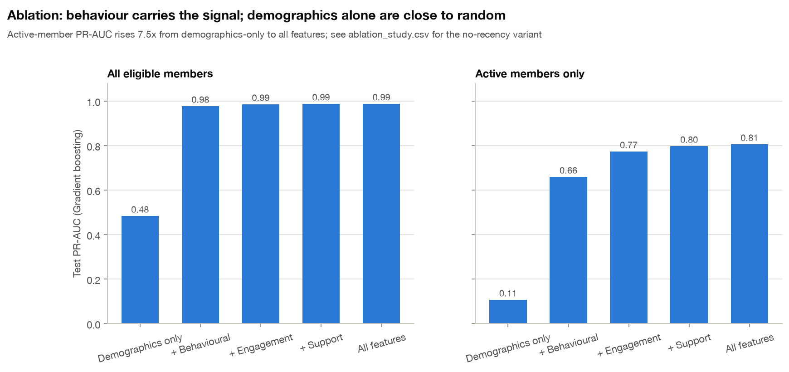

- **Demographics alone are no better than chance** for Active members (PR-AUC 0.11 vs a 9.6% base rate).
- **Behavioural** features carry most of the signal.
- **Engagement** adds +0.11 PR-AUC.
- **Support** adds +0.02.
- **Without recency** the final model still reaches 0.80, so the early-warning signal is
  not just "hasn't bought lately".

## 8. Retention scenarios

Expected churners prevented = churn probability x relative uplift. Net value = margin retained − cost. All assumptions are listed in
Section 10, and the uplifts are deliberately varied in the sensitivity chart.

| Scenario | Members | Churners prevented | Cost | Margin retained | Net value | ROI | Break-even uplift |
|---|---|---|---|---|---|---|---|
| A. Blanket coupon (status quo) | 2368 | 58.7 | $23,680 | $8,257 | −$15,423 | -65% | 21% |
| B. Targeted coupon | 179 | 20.4 | $1,790 | $2,983 | $1,193 | +67% | 9% |
| C1. Support outreach, rule-based | 383 | 22.2 | $5,745 | $3,398 | −$2,347 | -41% | 42% |
| C2. Support outreach, model-targeted | 94 | 18.8 | $1,410 | $2,858 | $1,448 | +103% | 12% |
| D. Win-back for lapsed | 653 | 32.0 | $3,265 | $4,283 | $1,018 | +31% | 4% |
| E. Next-best-action playbook | 549 | 43.0 | $3,860 | $7,419 | $3,559 | +92% | n/a |

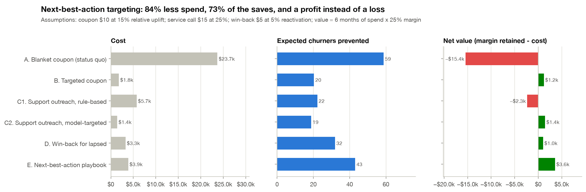
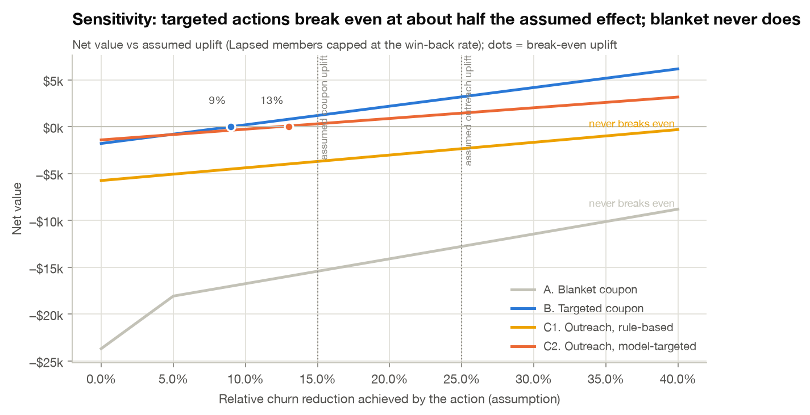

- **Blanket coupon (status quo)** never breaks even. Most of the money goes to members who were staying anyway, or who have already left.
- **Support outreach**, as the brief suggested, loses money if every member with tickets is called (−$2,347). The same calls
  **restricted to model-flagged members** return $1,448 (ROI +103%) and reach 85%
  of the saves with a quarter of the calls.
- **A model-based what-if supports this.** Re-scoring the 383 support-issue members with their tickets
  "resolved" lowers mean risk from 23% to 14%
  (41% relative). This is associational, so treat it as an upper bound; our planning assumption is 25%.
- **The targeted coupon** breaks even at a 9% uplift, against 21% for the blanket coupon.
- **Next-best-action playbook (recommended):** each member receives at most one action, and only when its expected value is positive:

| Recommended action | Members | Expected net value | 6-month revenue at risk |
|---|---|---|---|
| Monitor (no paid action) | 1819 | $0 | $92,889 |
| Personalised coupon | 59 | $562 | $30,709 |
| Proactive service call | 82 | $1,527 | $44,106 |
| Win-back offer | 408 | $1,540 | $280,895 |

The playbook lowers expected churn among Active members from 10.4% to 9.1% next quarter
and recovers about 32 lapsed members, for a net $3,559 on this cohort. The full ranked list, with action, value at risk and
drivers per member, is in `outputs/retention_action_list.csv`.

## 9. Recommendations

1. **Redefine the churn KPI.** Report *Lapsed* (no purchase 3+ months: win-back) separately from *At-risk Active*. Add a **60-day
   no-purchase trigger**: churn jumps from 3% to 38% after one missed month, and to 81% after two.
2. **Replace blanket coupons with monthly next-best-action targeting.** Each month, score all members, then send:
   - **service calls** to high-risk members with support issues;
   - **preferred-category coupons** to other high-risk Active members;
   - **win-back offers** to high-value lapsed members.

   The expected result is about 84% lower spend, with a profit instead of a loss.
3. **Make service recovery a retention lever.** Members with 2+ tickets churn at 19-37%. Close the loop on tickets within the 2-month
   fingerprint window, with priority for members the model flags.
4. **Automate free nudges before paid offers.** A 40%+ spend drop or app use below 0.5 sessions/month should trigger app push and
   personalised content first.
5. **Revisit tier benefits.** Platinum perks are not buying loyalty. Test engagement-based rewards (app streaks, category missions) instead of
   spend-only tiers.
6. **Measure, don't assume.** Hold out 20% of flagged members as a control group for one quarter, measure the true uplift of each action,
   and feed the measured effects back into `config.py`.
7. **Operationalise on the existing stack.** Run a monthly Databricks job (Data Factory ingest → Delta → `spark_features.py` → MLflow
   champion model → CRM queue), and monitor PR-AUC, calibration and feature drift each month.

## 10. Assumptions

1. **Target.** CHURNED = no transactions in Apr-Jun 2024 for a member who purchased before April (official label, used as-is). Members who never purchased (120 in the label table), the 6 profiled members with no activity, and 5 labelled churners with no pre-April activity cannot be scored from history and are excluded, leaving 2,368 eligible members.
2. **Missing months.** A month with no row *between* a member's first and last rows is lost data, not inactivity (the label table's MONTHS_OBSERVED counts these months as observed). Months *after* a member's last row are treated as zero activity, which is what a live system would see at scoring time.
3. **Spend repair.** TOTAL_SPEND = TRANSACTIONS x AVG_BASKET_VALUE holds for 99.8% of rows, so negative, zero and 9-15x inflated spend values are rebuilt from that identity rather than dropped.
4. **Impossible zero-transaction values.** Categories bought and coupons redeemed in months with zero transactions are set to 0.
5. **Historical labels.** Snapshots at Jul-23, Oct-23 and Jan-24 reuse the official definition (no purchase in the next 3 months). Applied at Apr-24 this rebuilt label agrees with the official one for 99.8% of members.
6. **Feature window.** All behavioural features use the 6 months before each cut-off, so snapshots are comparable. Recency is capped at 7 months ("6+").
7. **Categoricals.** City and tier variants are standardised by trimming and title-casing (40 to 10 cities, 12 to 3 tiers). Missing gender and price tier become an explicit 'Unknown'. Missing age is filled with the median of the training snapshots, plus a missing flag.
8. **Decision threshold.** 0.37 maximises F1 for Active members of the validation snapshot. High risk means p at or above the threshold; Medium means p of 10% or more.
9. **Economics (not measured, varied in sensitivity analysis).** Value of a retained member = 6 months of their typical monthly spend x 25% gross margin. Coupon: $10 cost, cuts churn probability by 15% (relative). Service call: $15, cuts it by 25%. Win-back: $5, reactivates 5%. Any offer to a Lapsed member is assumed to work only as well as a win-back.
10. **Repeated members.** The same member can appear in up to two training snapshots, so training rows are not fully independent. This is standard for rolling-origin designs, and the test cohort is strictly later in time.

## 11. Limitations

- **One test quarter.** Results are validated on one forward quarter (with three earlier snapshots for training and validation). Seasonality
  beyond 18 months is untested.
- **Small sample.** There are only 164 Active churners in the test cohort, so the 95% interval on Active PR-AUC is ±0.06. More history would
  tighten it.
- **Uplifts are assumptions, not measurements.** The scenario values depend on them, which is why break-even points and sensitivity are
  reported and a controlled test is recommended.
- **SHAP is not causal.** SHAP values and the support what-if describe associations. A member with many tickets may churn because of an
  underlying problem (a store move, a bad experience) that a phone call cannot fix.
- **Limited data.** There is no transaction-level, product, price, competitor or exit-reason data. Why members leave is inferred from
  behaviour, not observed.
- **Missing months.** The 953 missing months are treated as lost data. If some were genuine inactivity, a few trend features are slightly
  optimistic for those members.
- **Correlated features.** Several features are strongly correlated (transactions, spend, active months), so individual logistic
  coefficients and SHAP shares between correlated features should be read as a group, not one by one.

## 12. Reproducibility and production path

- `python run_pipeline.py` regenerates every output, chart, the executed notebook, this report and the slide deck (about 1 minute).
- Fixed seeds, pinned `requirements.txt`, and MLflow tracking for every model run (`outputs/mlflow_runs_summary.csv`).
- `python -m pytest`: unit tests, including an **automated leakage test** that corrupts all post-cut-off data and asserts the features
  do not change.
- **Databricks / Spark:** `src/spark_features.py` is a PySpark port of the feature builder. Verified: identical outputs for 8,302 member-snapshots across 4 cut-offs (31 feature columns, zero mismatches).
  `notebooks/02_databricks_churn_job.py` shows the scheduled job on Azure Data Factory, Delta tables and the MLflow registry.
- **API:** `uvicorn src.api:app` serves `/score` for real-time scoring, for example from the CRM.
